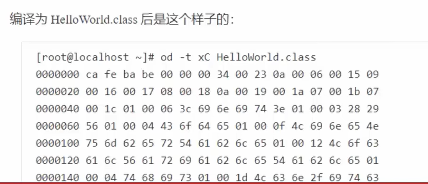
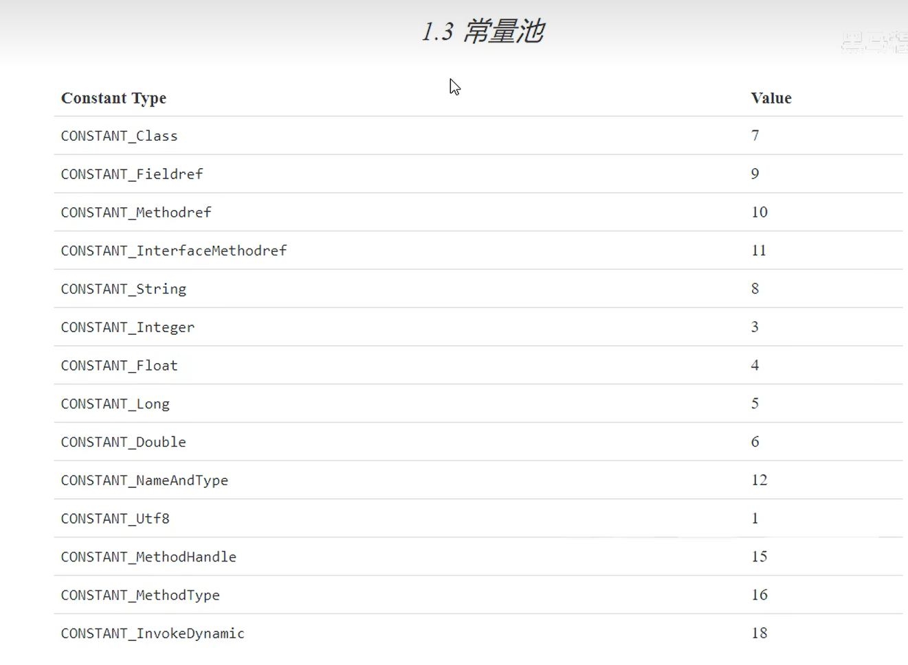
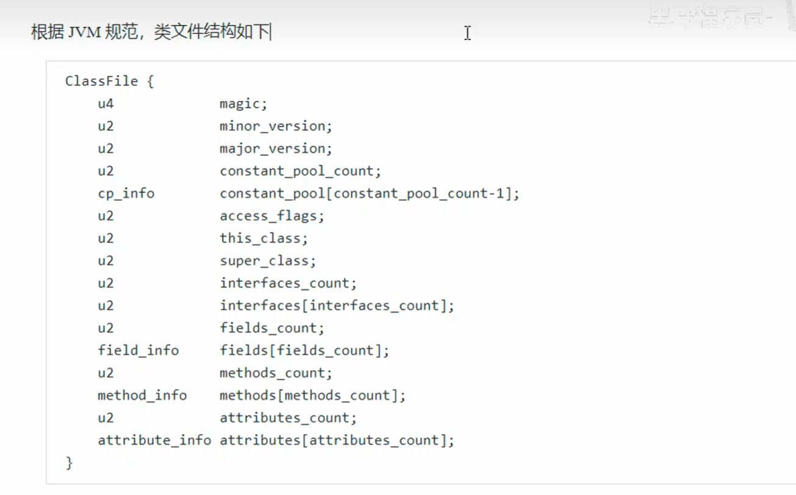

## 1. 类加载的概述

> Java 源代码（`.java`）经过编译器编译后，会生成 `.class` 字节码文件，JVM 再将 `.class` 文件加载到内存中执行。
> 本章围绕这一过程，从以下 6 个方面展开：

1. **类文件结构** — `.class` 文件的二进制格式是什么样的
2. **字节码指令** — JVM 能识别哪些指令，如何执行
3. **编译期处理** — `javac` 编译时做了哪些优化和语法糖处理
4. **类加载阶段** — `.class` 文件如何被 JVM 加载进内存（加载→验证→准备→解析→初始化）
5. **类加载器** — 谁来负责加载类（Bootstrap / Extension / Application / 自定义）
6. **运行期优化** — JIT 即时编译器如何将热点字节码编译为本地机器码提升性能

---

## 2. 类文件的结构

`.class` 文件是一种**与平台无关的二进制格式**，JVM 规范严格定义了它的每一个字节的含义。

### 2.1 示例代码

```java
package cn.itcast.jvm.t5;

public class HelloWorld {
    public static void main(String[] args) {
        System.out.println("HelloWorld");
    }
}
// 编译命令：javac -parameters -d . HelloWorld.java
```

编译后会生成 `HelloWorld.class` 文件，用十六进制查看器打开，可以看到如下二进制内容：

```
ca fe ba be  00 00 00 34  00 23  0a 00 06 00 15 ...
```

### 2.2 class 文件整体结构

| 区域 | 说明 |
|------|------|
| 魔数（Magic Number） | 固定为 `ca fe ba be`，JVM 用来识别合法的 class 文件 |
| 版本号（Version） | minor_version + major_version，标识编译器版本 |
| 常量池（Constant Pool） | 存储类名、方法名、字符串字面量等符号信息 |
| 访问标识（Access Flags） | 标识类是 public / abstract / interface 等 |
| 类索引 / 父类索引 / 接口索引 | 描述继承关系 |
| 字段表（Fields） | 类中定义的所有字段信息 |
| 方法表（Methods） | 类中定义的所有方法信息（含字节码指令） |
| 附加属性（Attributes） | 源文件名、行号表、局部变量表等调试信息 |

> 编译后的结构示意图如下：



---

## 3. 类文件结构 — 常量池

> 常量池是 class 文件的"字典"，类中用到的所有**类名、方法名、字段名、字符串字面量**都存在这里，其他区域通过索引（#1、#2...）引用它。



### 3.1 字节解读示例

以 HelloWorld.class 的开头字节为例逐段解析：

```
ca fe ba be  00 00 00 34  00 23  0a 00 06 00 15  09 ...
```

| 字节内容 | 含义 |
|----------|------|
| `ca fe ba be` | **魔数**，固定值，标识这是一个合法的 class 文件（"Cafe Babe"） |
| `00 00` | minor_version（次版本号）= 0 |
| `00 34` | major_version（主版本号）= 52，对应 **Java 8** |
| `00 23` | 常量池长度 = 0x23 = **35**，表示常量池有 **#1 ~ #34** 共 34 项（#0 不计入） |
| `0a` | 第 **#1** 项的类型标志，`0a` = 10，表示 **CONSTANT_Methodref（方法引用）** |
| `00 06` | 指向常量池 **#6** 项，表示该方法所属的**类名** |
| `00 15` | 指向常量池 **#21** 项，表示该方法的**方法名和描述符**（NameAndType） |

> 💡 **回表查询**：常量池中的项互相引用，需要根据索引逐层查找，最终得到完整的类名、方法名等字符串信息。

### 3.2 常量池常见类型

| 标志值（tag） | 类型名称 | 含义 |
|:---:|---|---|
| 1 | CONSTANT_Utf8 | UTF-8 编码的字符串（类名、方法名等最终都存这里） |
| 7 | CONSTANT_Class | 类或接口的符号引用，指向一个 Utf8 项 |
| 8 | CONSTANT_String | 字符串字面量，指向一个 Utf8 项 |
| 9 | CONSTANT_Fieldref | 字段引用，包含类索引 + NameAndType 索引 |
| 10 | CONSTANT_Methodref | 方法引用，包含类索引 + NameAndType 索引 |
| 12 | CONSTANT_NameAndType | 方法或字段的名称和描述符 |

---

## 4. 访问标识与继承信息

> 常量池之后是类的**访问标识（Access Flags）**，用来描述这个类的修饰符，以及它的父类和实现的接口。



| 标志名 | 十六进制值 | 含义 |
|--------|:---:|------|
| ACC_PUBLIC | 0x0001 | 类是 public 的 |
| ACC_FINAL | 0x0010 | 类是 final 的，不可继承 |
| ACC_SUPER | 0x0020 | 允许使用 invokespecial 指令（JDK 1.1 后所有类都有） |
| ACC_INTERFACE | 0x0200 | 这是一个接口 |
| ACC_ABSTRACT | 0x0400 | 这是一个抽象类 |

> 例如：`HelloWorld` 是 `public` 类，访问标识 = `ACC_PUBLIC | ACC_SUPER` = `0x0021`

---

## 5. Method 信息

> 方法表记录了类中每个方法的**访问标识、方法名、描述符（参数类型+返回类型）以及方法体的字节码指令**。

每个方法包含以下信息：

| 字段 | 说明 |
|------|------|
| access_flags | 方法的访问修饰符（public / static / final 等） |
| name_index | 指向常量池中方法名的 Utf8 项 |
| descriptor_index | 指向常量池中方法描述符，如 `([Ljava/lang/String;)V` 表示参数为 String[]，返回 void |
| attributes | 方法的附加属性，最重要的是 **Code 属性**，存放字节码指令 |

> 例如 `main` 方法的描述符为 `([Ljava/lang/String;)V`：
> - `[Ljava/lang/String;` → 参数类型：String 数组
> - `V` → 返回类型：void

---

## 6. 附加属性（Attributes）

> 附加属性存储了一些辅助信息，如源文件名、行号映射、局部变量名等，主要用于调试和反编译。

以 HelloWorld.class 末尾的字节为例：

```
00 01  00 13  00 00 00 02  00 14
```

| 字节内容 | 含义 |
|----------|------|
| `00 01` | 附加属性数量 = **1** 个 |
| `00 13` | 属性名索引，指向常量池 **#19** 项 = `"SourceFile"` |
| `00 00 00 02` | 该属性的数据长度 = **2** 字节 |
| `00 14` | 属性值索引，指向常量池 **#20** 项 = `"HelloWorld.java"` |

> 💡 这就是为什么程序抛出异常时，堆栈信息能显示出 `.java` 文件名和行号——这些信息都记录在 class 文件的附加属性中。

---

## 参考文献

- [JVM 规范 — Class File Format（Java SE 8）](https://docs.oracle.com/javase/specs/jvms/se8/html/jvms-4.html)